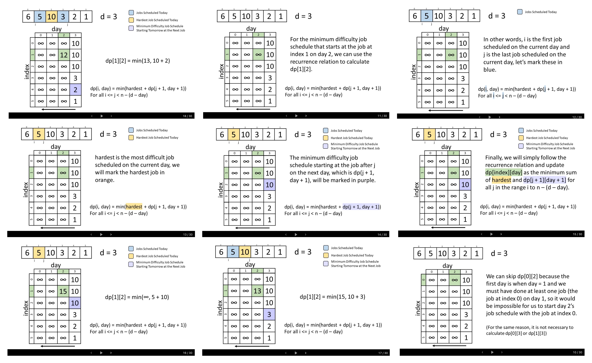
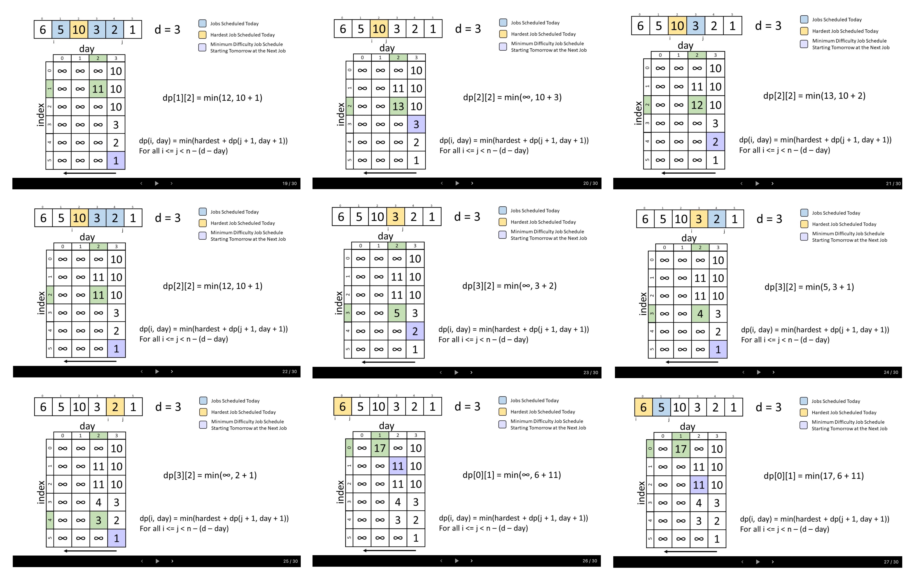
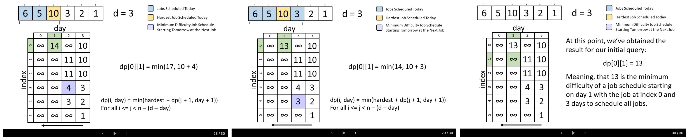

# Dynamic-Programming

***

  
<strong><h2>Strategic Approach to Dp</h2></strong> 

  
Framework for DP Problems 

<h5> Framework for DP Problems<h5>
In this section, we're going to talk about a framework for solving DP problems. This framework is applicable to nearly every DP problem and provides a clear step-by-step approach to developing DP algorithms.

> For this article's explanation, we're going to use the problem [Climbing Stairs](https://leetcode.com/problems/climbing-stairs/) as an example, with a top-down (recursive) implementation. Take a moment to read the problem description and understand what the problem is asking.

Before we start, we need to first define a term: **state**. In a DP problem, a state is a set of variables that can sufficiently describe a scenario. These variables are called state variables, and we only care about relevant ones. For example, to describe every scenario in Climbing Stairs, there is only 1 relevant state variable, the current step we are on. We can denote this with an integer \text{i}i. If \text{i = 6}i = 6, that means that we are describing the state of being on the 6th step. Every unique value of \text{i}i represents a unique state.

> You might be wondering what "relevant" means here. Picture this problem in real life: you are on a set of stairs, and you want to know how many ways there are to climb to say, the 10th step. We're definitely interested in what step you're currently standing on. However, we aren't interested in what color your socks are. You could certainly include sock color as a state variable. Standing on the 8th step wearing green socks is a different state than standing on the 8th step wearing red socks. However, changing the color of your socks will not change the number of ways to reach the 10th step from your current position. Thus the color of your socks is an **irrelevant** variable. In terms of figuring out how many ways there are to climb the set of stairs, the only relevant variable is what stair you are currently on.

#### The Framework
To solve a DP problem, we need to combine 3 things:

1. **A function or data structure that will compute/contain the answer to the problem for every given state.**

For Climbing Stairs, let's say we have an function \text{dp}dp where \text{dp(i)}dp(i) returns the number of ways to climb to the i^{th}i 
th
  step. Solving the original problem would be as easy as \text{return dp(n)}return dp(n).

How did we decide on the design of the function? The problem is asking "How many distinct ways can you climb to the top?", so we decide that the function will represent how many distinct ways you can climb to a certain step - literally the original problem, but generalized for a given state.

> Typically, top-down is implemented with a recursive function and hash map, whereas bottom-up is implemented with nested for loops and an array. When designing this function or array, we also need to decide on state variables to pass as arguments. This problem is very simple, so all we need to describe a state is to know what step we are currently on \text{i}i. We'll see later that other problems have more complex states.

2. **A recurrence relation to transition between states.**

A recurrence relation is an equation that relates different states with each other. Let's say that we needed to find how many ways we can climb to the 30th stair. Well, the problem states that we are allowed to take either 1 or 2 steps at a time. Logically, that means to climb to the 30th stair, we arrived from either the 28th or 29th stair. Therefore, the number of ways we can climb to the 30th stair is equal to the number of ways we can climb to the 28th stair plus the number of ways we can climb to the 29th stair.

The problem is, we don't know how many ways there are to climb to the 28th or 29th stair. However, we can use the logic from above to define a recurrence relation. In this case, \text{dp(i) = dp(i - 1) + dp(i - 2)}dp(i) = dp(i - 1) + dp(i - 2). As you can see, information about some states gives us information about other states.

> Upon careful inspection, we can see that this problem is actually the Fibonacci sequence in disguise! This is a very simple recurrence relation - typically, finding the recurrence relation is the most difficult part of solving a DP problem. We'll see later how some recurrence relations are much more complicated, and talk through how to derive them.

3. **Base cases, so that our recurrence relation doesn't go on infinitely.**

The equation \text{dp(i) = dp(i - 1) + dp(i - 2)}dp(i) = dp(i - 1) + dp(i - 2) on its own will continue forever to negative infinity. We need base cases so that the function will eventually return an actual number.

Finding the base cases is often the easiest part of solving a DP problem, and just involves a little bit of logical thinking. When coming up with the base case(s) ask yourself: What state(s) can I find the answer to without using dynamic programming? In this example, we can reason that there is only 1 way to climb to the first stair (1 step once), and there are 2 ways to climb to the second stair (1 step twice and 2 steps once). Therefore, our base cases are \text{dp(1) = 1}dp(1) = 1 and \text{dp(2) = 2}dp(2) = 2.

> We said above that we don't know how many ways there are to climb to the 28th and 29th stairs. However, using these base cases and the recurrence relation from step 2, we can figure out how many ways there are to climb to the 3rd stair. With that information, we can find out how many ways there are to climb to the 4th stair, and so on. Eventually, we will know how many ways there are to climb to the 28th and 29th stairs.

#### Example Implementations
Here is a basic top-down implementation using the 3 components from the framework:

  

Do you notice something missing from the code? We haven't memoized anything! The code above has a time complexity of O(2^n)O(2 
n
 ) because every call to \text{dp}dp creates 2 more calls to \text{dp}dp. If we wanted to find how many ways there are to climb to the 250th step, the number of operations we would have to do is approximately equal to the number of atoms in the universe.

In fact, without the memoization, this isn't actually dynamic programming - it's just basic recursion. Only after we optimize our solution by adding memoization to avoid repeated computations can it be called DP. As explained in chapter 1, memoization means caching results from function calls and then referring to those results in the future instead of recalculating them. This is usually done with a hashmap or an array.

  

With memoization, our time complexity drops to O(n)O(n) - astronomically better, literally.

> You may notice that a hashmap is overkill for caching here, and an array can be used instead. This is true, but using a hashmap isn't necessarily bad practice as some DP problems will require one, and they're hassle-free to use as you don't need to worry about sizing an array correctly. Furthermore, when using top-down DP, some problems do not require us to solve every single subproblem, in which case an array may use more memory than a hashmap.

We just talked a whole lot about top-down, but what about bottom-up? Everything is pretty much the same, except we will start from our base cases and iterate up to our final answer. As stated before, bottom-up implementations usually use an array, so we will use an array \text{dp}dp where \text{dp[i]}dp[i] represents the number of ways to climb to the i^{th}i 
th step.

  

> Notice that the implementation still follows the framework exactly - the framework holds for both top-down and bottom-up implementations.

#### To Summarize
With DP problems, we can use logical thinking to find the answer to the original problem for certain inputs, in this case we reason that there is 1 way to climb to the first stair and 2 ways to climb to the second stair. We can then use a recurrence relation to find the answer to the original problem for any state, in this case for any stair number. Finding the recurrence relation involves thinking about how moving from one state to another changes the answer to the problem.

This is the essence of dynamic programming. Here's a quick animation for Climbing Stairs:

  

  
Example 198 House Robber

<h5> Example 198 House Robber<h5>

> This is the first of 6 articles where we will use a framework to work through example DP problems. The framework provides a blueprint to solve DP problems, but when you are just starting to learn DP, deriving some of the logic yourself may be difficult. The objective of these articles is to talk through how to use the framework to work through each problem, and our goal is that, by the end of this, you will be able to independently tackle most DP problems using this framework.

In this article, we will be looking at the [House Robber](https://leetcode.com/problems/house-robber/) problem. In an earlier section of this explore card, we talked about how House Robber fits the characteristics of a DP problem. It's asking for the maximum of something, and our current decisions will affect which options are available for our future decisions. Let's see how we can use the framework to develop an algorithm for this problem.

1. A **function or array** that answers the problem for a given state

First, we need to decide on state variables. As a reminder, state variables should be fully capable of describing a scenario. Imagine if you had this scenario in real life - you're a robber and you have a lineup of houses. If you are at one of the houses, the only variable you would need to describe your situation is an integer - the index of the house you are currently at. Therefore, the only state variable is an integer, say i, that indicates the index of a house.

> If the problem had an added constraint such as "you are only allowed to rob up to k houses", then \text{k}k would be another necessary state variable. This is because being at, say house 4 with 3 robberies left is different than being at house 4 with 5 robberies left.

> You may be wondering - why don't we include a state variable that is a boolean indicating if we robbed the previous house or not? We certainly could include this state variable, but we can develop our recurrence relation in a way that makes it unnecessary. Building an intuition for this is difficult at first, but it becomes easier with practice.

The problem is asking for "the maximum amount of money you can rob". Therefore, we would use either a function \text{dp(i)}dp(i) that returns the maximum amount of money you can rob up to and including house \text{i}i, or an array \text{dp}dp where \text{dp[i]}dp[i] represents the maximum amount of money you can rob up to and including house \text{i}i.

This means that after all the subproblems have been solved, \text{dp[i]}dp[i] and \text{dp(i)}dp(i) both return the answer to the original problem for the subarray of \text{nums}nums that spans 00 to \text{i}i inclusive. To solve the original problem, we will just need to return \text{dp[nums.length - 1]}dp[nums.length - 1] or \text{dp(nums.length - 1)}dp(nums.length - 1), depending if we do bottom-up or top-down.

2. A **recurrence relation** to transition between states

> For this part, let's assume we are using a top-down (recursive function) approach. Note that the top-down approach is closer to our natural way of thinking and it is generally easier to think of the recurrence relation if we start with a top-down approach.

Next, we need to find a recurrence relation, which is typically the hardest part of the problem. For any recurrence relation, a good place to start is to think about a general state (in this case, let's say we're at the house at index \text{i}i), and use information from the problem description to think about how other states relate to the current one.

If we are at some house, logically, we have 2 options: we can choose to rob this house, or we can choose to not rob this house.
  1. If we decide not to rob the house, then we don't gain any money. Whatever money we had from the previous house is how much money we will have at this house - which is \text{dp(i - 1)}dp(i - 1).
  2. If we decide to rob the house, then we gain \text{nums[i]}nums[i] money. However, this is only possible if we did not rob the previous house. This means the money we had when arriving at this house is the money we had from the previous house without robbing it, which would be however much money we had 2 houses ago, \text{dp(i - 2)}dp(i - 2). After robbing the current house, we will have \text{dp(i - 2) + nums[i]}dp(i - 2) + nums[i] money.
From these two options, we always want to pick the one that gives us maximum profits. Putting it together, we have our recurrence relation: \text{dp(i)} = \max(\text{dp(i - 1), dp(i - 2) + nums[i]})dp(i)=max(dp(i - 1), dp(i - 2) + nums[i]) .

3. **Base cases**

The last thing we need is base cases so that our recurrence relation knows when to stop. The base cases are often found from clues in the problem description or found using logical thinking. In this problem, if there is only one house, then the most money we can make is by robbing the house (the alternative is to not rob the house). If there are only two houses, then the most money we can make is by robbing the house with more money (since we have to choose between them). Therefore, our base cases are:

  1. \text{dp(0) = nums[0]}dp(0) = nums[0]
  2. \text{dp(1)} = \max( \text{nums[0], nums[1]})dp(1)=max(nums[0], nums[1])

#### Top-down Implementation
Now that we have established all 3 parts of the framework, let's put it together for the final result. Remember: we need to memoize the function!

  

#### Bottom-up Implementation
Here's the bottom-up approach: everything is the same, except that we use an array instead of a hash map and we iterate using a for-loop instead of using recursion.

  

For both implementations, the time and space complexity is O(n)O(n). We'll talk about time and space complexity of DP algorithms in depth at the end of this chapter. Here's an animation that shows the algorithm in action:

  

  

  
Multidimensional DP

<h5> Multidimensional DP<h5>

The dimensions of a DP algorithm refer to the number of state variables used to define each state. So far all the algorithms we have looked at required only one state variable - therefore they are one-dimensional. In this section, we're going to talk about problems that require multiple dimensions.
Typically, the more dimensions a DP problem has, the more difficult it is to solve. Two-dimensional problems are common, and sometimes a problem might even require five dimensions. The good news is, the framework works regardless of the number of dimensions.
The following are common things to look out for in DP problems that require a state variable:

1. An index along with some input. This is usually used if an input is given as an array or string. This has been the sole state variable for all the problems that we've looked at so far, and it has represented the answer to the problem if the input was considered only up to that index - for example, if the input is 
nums = [0, 1, 2, 3, 4, 5, 6], then dp(4) would represent the answer to the problem for the input nums = [0, 1, 2, 3, 4].
2. A second index along with some input. Sometimes, you need two index state variables, say i and j. In some questions, these variables represent the answer to the original problem if you considered the input starting at index i and ending at index j. Using the same example above, dp(1, 3) would solve the problem for the input nums = [1, 2, 3], if the original input was [0, 1, 2, 3, 4, 5, 6].
3. Explicit numerical constraints given in the problem. For example, "you are only allowed to complete k transactions", or "you are allowed to break up to k obstacles", etc.
4. Variables that describe statuses in a given state. For example "true if currently holding a key, false if not", "currently holding k packages" etc.
5. Some sort of data like a tuple or bitmask used to indicate things being "visited" or "used". For example, "bitmask is a mask where the i^{th}bit indicates if the i^{th} city has been visited". Note that mutable data structures like arrays cannot be used - typically, only immutable data structures like numbers and strings can be hashed, and therefore memoized.

Multi-dimensional problems make us think harder about deciding what our function or array will represent, as well as what the recurrence relation should look like. In the next article, we'll walk through another example using the framework with a 2D DP problem.

### Top-down to Bottom-up

As we've said in the previous chapter, usually a top-down algorithm is easier to implement than the equivalent bottom-up algorithm. With that being said, it is useful to know how to take a completed top-down algorithm and convert it to bottom-up. There's a number of reasons for this: first, in an interview, if you solve a problem with top-down, you may be asked to rewrite your solution in an iterative manner (using bottom-up) instead. Second, as we mentioned before, bottom-up usually is more efficient than top-down in terms of runtime.

#### Steps to convert top-down into bottom-up

1. Start with a completed top-down implementation.

2. Initialize an array dp that is sized according to your state variables. For example, let's say the input to the problem was an array nums and an integer k that represents the maximum number of actions allowed. Your array dp would be 2D with one dimension of length nums.length and the other of length k. The values should be initialized as some default value opposite of what the problem is asking for. For example, if the problem is asking for the maximum of something, set the values to negative infinity. If it is asking for the minimum of something, set the values to infinity.

3. Set your base cases, same as the ones you are using in your top-down function. Recall in House Robber, 
dp(0) = nums[0] and dp(1) = max(nums[0], nums[1]). In bottom-up, dp[0] = nums[0] and dp[1] = max(nums[0], nums[1]).

4. Write a for-loop(s) that iterate over your state variables. If you have multiple state variables, you will need nested for-loops. These loops should start iterating from the base cases.

5. Now, each iteration of the inner-most loop represents a given state, and is equivalent to a function call to the same state in top-down. Copy the logic from your function into the for-loop and change the function calls to accessing your array. All dp(...) changes into dp[...].

We're done! dp is now an array populated with the answer to the original problem for all possible states. Return the answer to the original problem, by changing return dp(...) to return dp[...].

Let's try a quick example using the House Robber code from before. Here's a completed top-down solution:

  

First, we initialize an array dp sized according to our state variables. Our only state variable is 
i which can take n values.

  

Second, we should set our base cases. dp[0] = nums[0] and dp[1] = max(nums[0], nums[1]). To avoid index out of bounds, we should also just return 
nums[0] if theres only one house.

  

Next, write a for-loop to iterate over the state variables, starting from the base cases.

  

Lastly, copy the recurrence relation over from the top-down solution and put it in the for-loop. Return 
dp[n - 1].

  

  

  
Example 1770 Maximum Score from Performing Multiplication Operations

<h5>Example 1770 Maximum Score from Performing Multiplication Operations<h5>

> For this problem, we will again start by looking at a top-down approach.
In this article, we're going to be looking at the problem [Maximum Score from Performing Multiplication Operations](https://leetcode.com/problems/maximum-score-from-performing-multiplication-operations/). We can tell this is a DP problem because it is asking for a maximum score, and every time we choose to use a number from nums, it affects all future possibilities. Let's solve this problem with the framework:

1. A function or array that answers the problem for a given state

> In the following discussion, we will use 0-index, since it is more convienient for thinking and coding.

Since we're doing top-down, we need to decide on two things for our function dp. What state variables we need to pass to it, and what it will return. We are given two input arrays: nums and multipliers. The problem says we need to do m operations, and on the ith operation, we gain score equal to multipliers[i] times a number from either the left or right end of nums, which we remove after the operation. That means we need to know 3 things for each operation:

  1. How many operations have we done so far; this tells us what number from multipliers we will be using?
  2. The index of the leftmost number remaining in nums.
  3. The index of the rightmost number remaining in nums.
 
We can use one state variable, i, to indicate how many operations we have done so far, which means multipliers[i] is the current multiplier to be used. For the leftmost number remaining in nums, we can use another state variable, left, that indicates how many left operations we have done so far. If we have done, say 3 left operations, if we were to do another left operation we would use nums[3]. We can say the same thing for the rightmost remaining number - let's use a state variable right that indicates how many right operations we have done so far.

It may seem like we need all 3 of these state variables, but we can formulate an equation for one of them using the other two. If we know how many elements we have picked from the leftside, left, and we know how many elements we have picked in total,i, then we know that we must have picked i - left elements from the rightside. The original length of nums is n, which means the index of the rightmost element is right = n - 1 - (i - left). Therefore, we only need 2 state variables: i and left, and we can calculate right inside the function.

Now that we have our state variables, what should our function return? The problem is asking for the maximum score from some number of operations, so let's have our function dp(i, left) return the maximum possible score if we have already done i total operations and used left numbers from the left side. To answer the original problem, we should return dp(0, 0).

  

  

  

2. A recurrence relation to transition between states

At each state, we have to perform an operation. As stated in the problem description, we need to decide whether to take from the left end (
nums[left]) or the right end (nums[right]) of the current nums. Then we need to multiply the number we choose by multipliers[i], add this value to our score, and finally remove the number we chose from nums. For implementation purposes, "removing" a number from nums means incrementing our state variables 
i and left so that they point to the next two left and right numbers.

Let mult=multipliers[i] and right = nums.length - 1 - (i - left). The only decision we have to make is whether to take from the left or right of nums.

* If we choose left, we gain mult⋅nums[left] points from this operation. Then, the next operation will occur at (i + 1, left + 1). i gets incremented at every operation because it represents how many operations we have done, and left gets incremented because it represents how many left operations we have done. Therefore, our total score is mult⋅nums[left] + dp(i + 1, left + 1).
* If we choose right, we gain mult⋅nums[right] points from this operation. Then, the next operation will occur at (i + 1, left). Therefore, our total score is mult⋅nums[right] + dp(i + 1, left).
Since we want to maximize our score, we should choose the side that gives more points. This gives us our recurrence relation:

dp(i, left)=max(mult⋅nums[left]+dp(i + 1, left + 1), mult⋅nums[right]+dp(i + 1, left))

Where mult⋅nums[left]+dp(i + 1, left + 1) represents the points we gain by taking from the left end of nums plus the maximum points we can get from the remaining nums array and mult⋅nums[right]+dp(i + 1, left) represents the points we gain by taking from the right end of nums plus the maximum points we can get from the remaining nums array.

3. Base cases

The problem statement says that we need to perform m operations. When i equals m, that means we have no operations left. Therefore, we should return 0.

#### Top-down Implementation

Let's put the 3 parts of the framework together for a solution to the problem.

Protip: for Python, the [functools](https://docs.python.org/3/library/functools.html) module provides super handy tools that automatically memoize a function for us. We're going to use the @lru_cache decorator in the Python implementation.

> If you find yourself needing to memoize a function in an interview and you're using Python, check with your interviewer if using modules like functools is OK.
This particular problem happens to have very tight time limits. For Java, instead of using a hashmap for the memoization, we will use a 2D array. For Python, we're going to limit our cache size to 2000.

  

#### Bottom-up Implementation

In the bottom-up implementation, the array works the same way as the function from top-down. dp[i][left] represents the max score possible if i operations have been performed and left operations have been performed.

Earlier in the explore card, we learned that while bottom-up is typically faster than top-down, it is often harder to implement. This is because the order in which we iterate needs to be precise. You'll see in the implementations below that we use the same math to calculate right, and the same recurrence relation but we need to iterate backwards starting from m (because the base case happens when i equals m). We also need to initialize dp with one extra row so that we don't go out of bounds in the first iteration of the outer loop.

  

The time and space complexity of both implementations is O(m^2) where m is the length of multipliers. We will talk about more in depth about time and space complexity at the end of this chapter.
  

  
 

  
Time and Space Complexity

  <h5> Time and Space Complexity<h5>

  Finding the time and space complexity of a dynamic programming algorithm may sound like a daunting task. However, this task is usually not as difficult as it sounds. Furthermore, justifying the time and space complexity in an explanation is relatively simple as well. One of the main points with DP is that we never repeat calculations, whether by tabulation or memoization, we only compute a state once. Because of this, the time complexity of a DP algorithm is directly tied to the number of possible states.

  If computing each state requires F time, and there are n possible states, then the time complexity of a DP algorithm is O(n⋅F). With all the problems we have looked at so far, computing a state has just been using a recurrence relation equation, which is O(1). Therefore, the time complexity has just been equal to the number of states. To find the number of states, look at each of your state variables, compute the number of values each one can represent, and then multiply all these numbers together.

  Let's say we had 3 state variables: i, k, and holding for some made up problem. i is an integer used to keep track of an index for an input array nums, 
  k is an integer given in the input which represents the maximum actions we can do, and holding is a boolean variable. What will the time complexity be for a DP algorithm that solves this problem? Let n = nums.length and K be the maximum actions possible given in the input. i can be from 0 to 
  nums.length, k can be from 0 to K, and holding }can be true or false. Therefore, there are n⋅K⋅2 states. If computing each state is O(1), then the time complexity will be O(n⋅K⋅2)=O(n⋅K).

  Whenever we compute a state, we also store it so that we can refer to it in the future. In bottom-up, we tabulate the results, and in top-down, states are memoized. Since we store states, the space complexity is equal to the number of states. That means that in problems where calculating a state is O(1), the time and space complexity are the same. In many DP problems, there are optimizations that can improve both complexities - we'll talk about this later.
  

 
   
   
   
   
   
   
   
   
   

  
<strong><h2>Common Patterns In Dp</h2></strong> 

  
<strong>Iteration in the recurrence relation</strong>

          In all the problems we have looked at so far, the recurrence relation is a static equation - it never changes. Recall Min Cost Climbing Stairs. The recurrence relation was:
dp(i)=min(dp(i - 1) + cost[i - 1], dp(i - 2) + cost[i - 2])

because we are only allowed to climb 1 or 2 steps at a time. What if the question was rephrased so that we could take up to 
k steps at a time? The recurrence relation would become dynamic - it would be:
dp(i)=min(dp(j) + cost[j]) for all (i - k)≤j<i

We would need iteration in our recurrence relation.

This is a common pattern in DP problems, and in this chapter, we're going to take a look at some problems using the framework where this pattern is applicable. While iteration usually increases the difficulty of a DP problem, particularly with bottom-up implementations, the idea isn't too complicated. Instead of choosing from a static number of options, we usually add a for-loop to iterate through a dynamic number of options and choose the best one.

  

  
<strong>Example 1335 Minimum Difficulty of a Job Schedul</strong> 

  
  
>  We'll start with a top-down approach.

In this article, we'll be using the framework to solve [Minimum Difficulty of a Job Schedule](https://leetcode.com/problems/minimum-difficulty-of-a-job-schedule/). We can tell this is a problem where Dynamic Programming can be used because we are asked for the minimum of something, and deciding how many jobs to do on a given day affects the jobs we can do on all future days. Let's start solving:

1. A function that answers the problem for a given state

Let's first decide on state variables. What decisions are there to make, and what information do we need to make these decisions? Reading the problem description carefully, there are d total days, and on each day we need to complete some number of jobs. By the end of the d days, we must have finished all jobs (in the given order). Therefore, we can see that on each day, we need to decide how many jobs to take.

* Let's use one state variable i, where i is the index of the first job that will be done on the current day.

* Let's use another state variable day, where day indicates what day it currently is.

The problem is asking for the minimum difficulty, so let's have a function dp(i, day) that returns the minimum difficulty of a job schedule which starts on the ith job and day. To solve the original problem, we will just return dp(0, 1), since we start on the first day with no jobs done yet.
  

  

  

  

2. A recurrence relation to transition between states

At each state, we are on day and need to do job i. Then, we can choose to do a few more jobs. How many more jobs are we allowed to do? The problem says that we need to do at least one job per day. This means we must leave at least d - day jobs so that all the future days have at least one job that can be scheduled on that day. If n is the total number of jobs, jobDifficulty.length, that means from any given state (i, day), we are allowed to do the jobs from index i up to but not including index n - (d - day).

We should try all the options for a given day - try doing only one job, then two jobs, etc. until we can't do any more jobs. The best option is the one that results in the easiest job schedule.

The difficulty of a given day is the most difficult job that we did that day. Since the jobs have to be done in order, if we are trying all the jobs we are allowed to do on that day (iterating through them), then we can use a variable hardest to keep track of the difficulty of the hardest job done today. If we choose to do jobs up to the jth job (inclusive), where i≤j<n - (d - day) (as derived above), then that means on the next day, we start with the 
(j+1)th job. Therefore, our total difficulty is hardest + dp(j + 1, day + 1). This gives us our scariest recurrence relation so far: 

dp(i, day) = min(hardest + dp(j + 1, day + 1)) for all i≤j<n - (d - day),where 
  
hardest = max(jobDifficulty[k]) for all i≤k≤j.

The codified recurrence relation is a scary one to look at for sure. However, it is easier to understand when we break it down bit by bit. On each day, we try all the options - do only one job, then two jobs, etc. until we can't do any more (since we need to leave some jobs for future days). 
hardest is the hardest job we do on the current day, which means it is also the difficulty of the current day. We add hardest to the next state which is the next day, starting with the next job. After trying all the jobs we are allowed to do, choose the best result.
  

  

  

3. Base cases

Despite the recurrence relation being complicated, the base cases are much simpler. We need to finish all jobs in d days. Therefore, if it is the last day 
(day == d), we need to finish up all the remaining jobs on this day, and the total difficulty will just be the largest number in jobDifficulty on or after index i.

if day == d then return the maximum job difficulty between job i and the end of the array (inclusive).

We can precompute an array hardestJobRemaining where hardestJobRemaining[i] represents the difficulty of the hardest job on or after day i, so that this base case is handled in constant time.

Additionally, if there are more days than jobs (n < d), then it is impossible to do at least one job each day, and per the problem description, we should return -1. We can check for this case at the very start.

#### Top-down Implementation

Let's combine these 3 parts for a top-down implementation. Again, we will use [functools](https://docs.python.org/3/library/functools.html) in Python, and a 2D array in Java for memoization. In the Python implementation, we are passing None to lru_cache which means the cache size is not limited. We are doing this because the number of states that will be re-used in this problem is large, and we don't want to evict a state early and have to re-calculate it.

  

  

#### Bottom-up Implementation

With bottom-up, we now use a 2D array where dp[i][day] represents the minimum difficulty of a job schedule that starts on day and job i. It depends on the problem, but the bottom-up code generally has a faster runtime than its top-down equivalent. However, as you can see from the code, it looks like it is more challenging to implement. We need to first tabulate the base case and then work backwards from them using nested for loops.

The for-loops should start iterating from the base cases, and there should be one for-loop for each state variable. Remember that one of our base cases is that on the final day, we need to complete all jobs. Therefore, our for-loop iterating over day should iterate from the final day to the first day. Then, our next for-loop for i should conform to the restraints of the problem - we need to do at least one job per day.

  

 

Here's an animation showing the algorithm in action:

  

 

  

 
  

  

  

  

 
  
  
The time and space complexity of these algorithms can be quite tricky, and as in this example, there are sometimes slight differences between the top-down and bottom-up complexities.

Let's start with the bottom-up space complexity, because it follows what we learned in the previous chapter about finding time and space complexity. For this problem, the number of states is n⋅d. This means the space complexity is O(n⋅d) as our dp table takes up that much space.

The top-down algorithm's space complexity is actually a bit better. In top-down, when we memoize results with a hashtable, the hashtable's size only grows when we visit a state and calculate the answer for it. Because of the restriction of needing to complete at least one task per day, we don't actually need to visit all n⋅d states. For example, if there were 10 jobs and 5 days, then the state (9, 2) (starting the final job on the second day) is not reachable, because the 3rd, 4th, and 5th days wouldn't have a job to complete. This is true for both implementations and is enforced by our for-loops, and as a result, we only actually visit d⋅(n−d) states. This means the space complexity for top-down is O(d⋅(n−d)). This is one advantage that top-down can have over bottom-up. With the bottom-up implementation, we can't really avoid allocating space for n⋅d states because we are using a 2D array.

The time complexity for both algorithms is more complicated. As we just found out, we only actually visit d⋅(n−d) states. At each state, we go through a for-loop (with variable j) that iterates on average (n−d)/2 times. This means our time complexity for both algorithms is O(d⋅(n−d)^2).

To summarize:

Time complexity (both algorithms): 
O(d⋅(n−d)^2)

Space complexity (top-down): O((n−d)⋅d)

Space complexity (bottom-up): O(n⋅d)

> While the theoretical space complexity is better with top-down, practically speaking, the 2D array is more space-efficient than a hashmap, and the difference in space complexities here doesn't justify saying that top-down will use less space than bottom-up.

  

   
<strong>Example 139 Word Break</strong>

  
  

     
<strong>State Transition by Inaction</strong>

  

  
  

  
<strong>Example 188 Best Time to Buy and Sell Stock IV</strong>

  <h5> Txample 188 Best Time to Buy and Sell Stock IV<h5>
        hello
  

  
 

   

  
<strong><h2>Common Patterns Continued</h2></strong> 

 

 

   
<strong><h2>Dp for paths in matrix</h2></strong> 

 

 

  
<strong><h2>More Practice Problems</h2></strong> 

 

    
  We'll start with a top-down approach.
In this article, we'll be using the framework to solve Minimum Difficulty of a Job Schedule. We can tell this is a problem where Dynamic Programming can be used because we are asked for the minimum of something, and deciding how many jobs to do on a given day affects the jobs we can do on all future days. Let's start solving:

1. A function that answers the problem for a given state

Let's first decide on state variables. What decisions are there to make, and what information do we need to make these decisions? Reading the problem description carefully, there are d total days, and on each day we need to complete some number of jobs. By the end of the d days, we must have finished all jobs (in the given order). Therefore, we can see that on each day, we need to decide how many jobs to take.

* Let's use one state variable i, where i is the index of the first job that will be done on the current day.

* Let's use another state variable day, where day indicates what day it currently is.

The problem is asking for the minimum difficulty, so let's have a function dp(i, day) that returns the minimum difficulty of a job schedule which starts on the ith job and day. To solve the original problem, we will just return dp(0, 1), since we start on the first day with no jobs done yet.

2. A recurrence relation to transition between states

At each state, we are on day and need to do job i. Then, we can choose to do a few more jobs. How many more jobs are we allowed to do? The problem says that we need to do at least one job per day. This means we must leave at least d - day jobs so that all the future days have at least one job that can be scheduled on that day. If n is the total number of jobs, jobDifficulty.length, that means from any given state (i, day), we are allowed to do the jobs from index i up to but not including index n - (d - day).

We should try all the options for a given day - try doing only one job, then two jobs, etc. until we can't do any more jobs. The best option is the one that results in the easiest job schedule.

The difficulty of a given day is the most difficult job that we did that day. Since the jobs have to be done in order, if we are trying all the jobs we are allowed to do on that day (iterating through them), then we can use a variable hardest to keep track of the difficulty of the hardest job done today. If we choose to do jobs up to the jth job (inclusive), where i≤j<n - (d - day) (as derived above), then that means on the next day, we start with the 
(j+1)th job. Therefore, our total difficulty is hardest + dp(j + 1, day + 1). This gives us our scariest recurrence relation so far: 
dp(i, day) = min(hardest + dp(j + 1, day + 1)) for all i≤j<n - (d - day), 
where hardest = max(jobDifficulty[k]) for all i≤k≤j.

The codified recurrence relation is a scary one to look at for sure. However, it is easier to understand when we break it down bit by bit. On each day, we try all the options - do only one job, then two jobs, etc. until we can't do any more (since we need to leave some jobs for future days). 
hardest is the hardest job we do on the current day, which means it is also the difficulty of the current day. We add hardest to the next state which is the next day, starting with the next job. After trying all the jobs we are allowed to do, choose the best result.

Current
1 / 3

3. Base cases

Despite the recurrence relation being complicated, the base cases are much simpler. We need to finish all jobs in d days. Therefore, if it is the last day 
(day == d), we need to finish up all the remaining jobs on this day, and the total difficulty will just be the largest number in jobDifficulty on or after index i.
if day == d then return the maximum job difficulty between job i and the end of the array (inclusive).

We can precompute an array hardestJobRemaining where hardestJobRemaining[i] represents the difficulty of the hardest job on or after day i, so that this base case is handled in constant time.

Additionally, if there are more days than jobs (n < d), then it is impossible to do at least one job each day, and per the problem description, we should return -1. We can check for this case at the very start.

Top-down Implementation

Let's combine these 3 parts for a top-down implementation. Again, we will use [functools](https://docs.python.org/3/library/functools.html) in Python, and a 2D array in Java for memoization. In the Python implementation, we are passing None to lru_cache which means the cache size is not limited. We are doing this because the number of states that will be re-used in this problem is large, and we don't want to evict a state early and have to re-calculate it.

Bottom-up Implementation

With bottom-up, we now use a 2D array where dp[i][day] represents the minimum difficulty of a job schedule that starts on day and job i. It depends on the problem, but the bottom-up code generally has a faster runtime than its top-down equivalent. However, as you can see from the code, it looks like it is more challenging to implement. We need to first tabulate the base case and then work backwards from them using nested for loops.

The for-loops should start iterating from the base cases, and there should be one for-loop for each state variable. Remember that one of our base cases is that on the final day, we need to complete all jobs. Therefore, our for-loop iterating over day should iterate from the final day to the first day. Then, our next for-loop for i should conform to the restraints of the problem - we need to do at least one job per day.

Here's an animation showing the algorithm in action:

The time and space complexity of these algorithms can be quite tricky, and as in this example, there are sometimes slight differences between the top-down and bottom-up complexities.

Let's start with the bottom-up space complexity, because it follows what we learned in the previous chapter about finding time and space complexity. For this problem, the number of states is n⋅d. This means the space complexity is O(n⋅d) as our dp table takes up that much space.

The top-down algorithm's space complexity is actually a bit better. In top-down, when we memoize results with a hashtable, the hashtable's size only grows when we visit a state and calculate the answer for it. Because of the restriction of needing to complete at least one task per day, we don't actually need to visit all n⋅d states. For example, if there were 10 jobs and 5 days, then the state (9, 2) (starting the final job on the second day) is not reachable, because the 3rd, 4th, and 5th days wouldn't have a job to complete. This is true for both implementations and is enforced by our for-loops, and as a result, we only actually visit d⋅(n−d) states. This means the space complexity for top-down is O(d⋅(n−d)). This is one advantage that top-down can have over bottom-up. With the bottom-up implementation, we can't really avoid allocating space for n⋅d states because we are using a 2D array.

The time complexity for both algorithms is more complicated. As we just found out, we only actually visit d⋅(n−d) states. At each state, we go through a for-loop (with variable j) that iterates on average (n−d)/2 times. This means our time complexity for both algorithms is O(d⋅(n−d)^2).

To summarize:

Time complexity (both algorithms): 
O(d⋅(n−d)^2)

Space complexity (top-down): O((n−d)⋅d)

Space complexity (bottom-up): O(n⋅d)

> While the theoretical space complexity is better with top-down, practically speaking, the 2D array is more space-efficient than a hashmap, and the difference in space complexities here doesn't justify saying that top-down will use less space than bottom-up.
